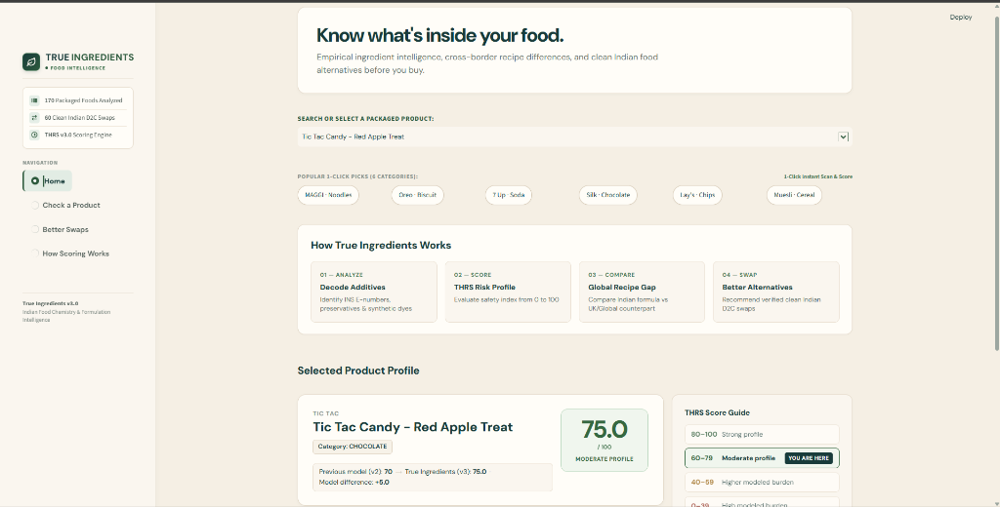
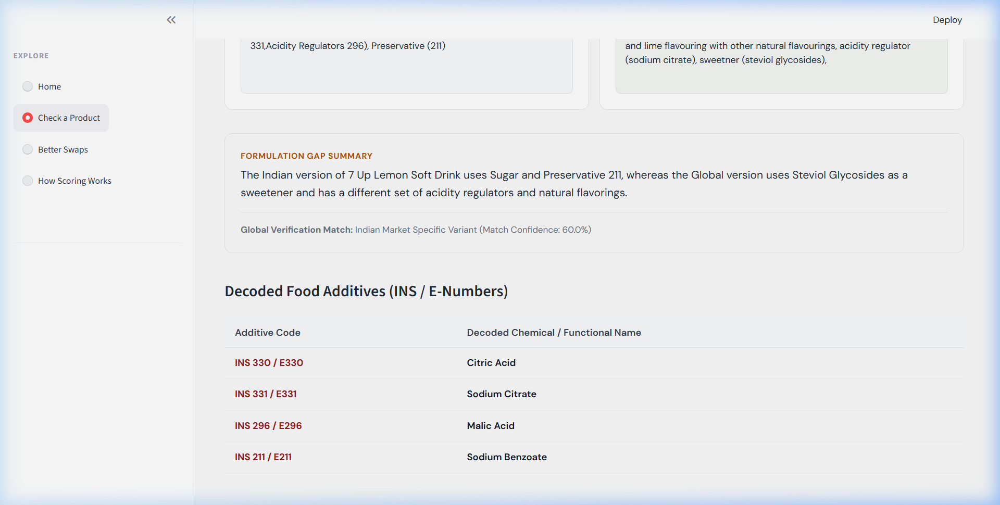
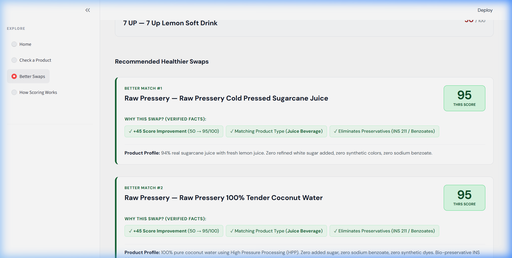
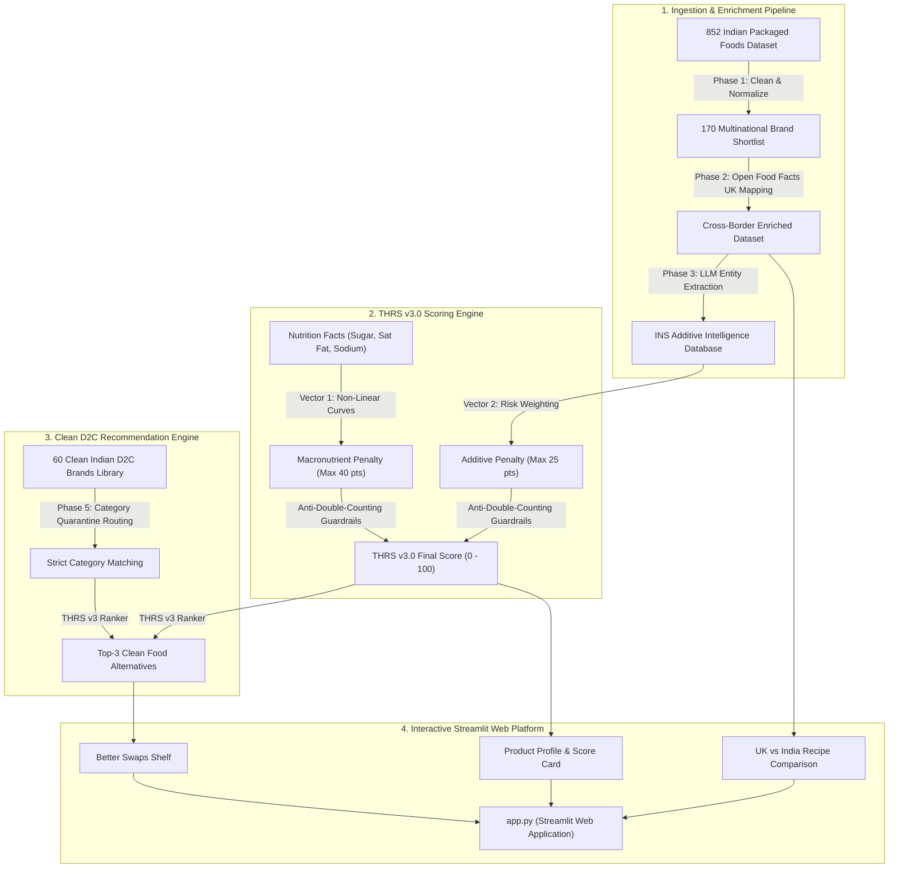

# 🌿 TRUE INGREDIENTS — Food Intelligence Platform

> **Empirical ingredient intelligence, cross-border recipe difference detection, and clean Indian startup (D2C) food alternatives before you buy.**

[](https://www.python.org/)
[](https://streamlit.io/)
[](https://scikit-learn.org/)
[](LICENSE)
[]()

---

## 📸 Application Interface

| **Interactive Search Bar & 1-Click Popular Shelf** |
| :---: |
|  |

| **Cross-Border Recipe Inspector** | **Clean D2C Alternative Swaps** |
| :---: | :---: |
|  |  |

---

## 📌 Executive Overview

Ultra-processed packaged foods in India frequently contain hidden chemical additives, synthetic petroleum dyes, chemical preservatives, and excessive saturated fats or sugar. Furthermore, multinational food corporations often sell **lower-grade formulations in India** compared to their UK/European counterparts (e.g., substituting heart-healthy sunflower oil with cheap palm oil, or using synthetic Tartrazine dye instead of natural fruit concentrates).

**True Ingredients** is an end-to-end consumer food intelligence platform that:
1. **Decodes 170 Packaged Indian Foods** across 6 core grocery categories.
2. **Evaluates Transparent Health Risk Scores (THRS v3.0)** using an empirical, non-linear dual-vector mathematical formulation.
3. **Exposes Global Recipe Discrepancies** via Open Food Facts UK/Global counterpart mapping.
4. **Recommends 60 Verified Clean Indian D2C Swaps** (*Slurrp Farm, Mille, The Whole Truth, BeatO, Yoga Bar, TBH, Farmley*) with strict 100% category quarantine.

---

## 🏛️ System Architecture



---

## 🔬 Mathematical Scoring Framework (THRS v3.0)

The **Transparent Health Risk Score (THRS v3.0)** calculates an empirical health safety index from **0.0 (High Burden)** to **100.0 (Clean/Strong)** using a dual-vector formulation without cliff-edge step functions:

```text
THRS v3 = 100 - P_nutrition - P_ingredient
```

with the mathematical guarantees:
```text
P_nutrition <= 40,   P_ingredient <= 25
```

> **Core Formulation Principle:**
> **Nutrition penalty ($P_{\text{nutrition}}$)** captures quantitative nutrient burden (sugar, saturated fats, sodium), while the **ingredient/formulation penalty ($P_{\text{ingredient}}$)** captures bounded formulation signals (synthetic dyes, chemical preservatives, ultra-processed emulsifiers). Both are aggregated separately and then subtracted from a 100-point baseline.

### 1. Vector 1: Macronutrient Penalty ($P_{\text{nutrition}}$, Max 40 points)
Evaluates quantitative nutritional density against WHO and ICMR daily intake guidelines:
* **Added Sugar Penalty (0 to 20 pts):** Uses non-linear scaling curves ($(\text{Sugar}/50)^{1.4} \times 20$) preventing arbitrary cliff-edges while heavily penalizing high concentrations.
* **Saturated Fat Penalty (0 to 12 pts):** Penalizes concentrated palm oil and hydrogenated vegetable fats.
* **Sodium Density Penalty (0 to 8 pts):** Penalizes excessive sodium concentrations ($>600\text{mg} / 100\text{g}$).

### 2. Vector 2: Ingredient / Additive Penalty ($P_{\text{ingredient}}$, Max 25 points)
Rigorously classifies and weights INS chemical additives from physical packaging:
* **High-Risk Formulation Signals (-10 pts each):** Synthetic azo food dyes (*INS 102 Tartrazine, INS 110 Sunset Yellow, INS 122 Carmoisine, INS 129 Allura Red*), chemical preservatives (*INS 211 Sodium Benzoate, INS 224 Potassium Metabisulphite*), and high-potency artificial sweeteners (*INS 950 Acesulfame K, INS 951 Aspartame, INS 955 Sucralose*).
* **Ultra-Processed Watch Additives (-3 pts each):** Synthetic emulsifiers and industrial thickeners (*INS 471 Mono- and Diglycerides, INS 472e, INS 476 PGPR*).
* **Standard Bio-Identical Additives (0 pts):** Natural food regulators (*INS 330 Citric Acid, INS 322 Soy Lecithin, INS 392 Rosemary Extract*).

### 3. Anti-Double-Counting Guardrails
Guarantees that a single ingredient (e.g., refined sugar or vegetable oil) is only penalized once in the nutrition panel and never double-penalized in the additive checklist.

---

### 📊 Clinical Score Bands

| Score Range | Tier Label | Color Code | Clinical / Dietary Interpretation |
| :---: | :---: | :---: | :--- |
| **80.0 – 100.0** | **Strong Profile** | `#235431` (Forest Green) | Whole-food base, zero synthetic dyes/preservatives, low added sugar. |
| **60.0 – 79.9** | **Moderate Profile** | `#356840` (Sage Green) | Moderate processing; standard additives only; controlled macronutrient burden. |
| **40.0 – 59.9** | **Higher Burden** | `#9A6615` (Amber Gold) | High sugar/fat density or contains ultra-processed watch emulsifiers. |
| **0.0 – 39.9** | **High Burden** | `#98382C` (Crimson Red) | Severe ultra-processing; multiple synthetic petroleum dyes and preservatives. |

---

### 🧪 Worked Product Examples

* **Cadbury Oreo Original Biscuits (THRS v3: 63.1 / Moderate Profile):**
  * *Vector 1 (Macronutrients):* Sugar ($38.5\text{g}$) $-14.1\text{ pts}$, Saturated Fat ($9.8\text{g}$) $-7.8\text{ pts}$, Sodium ($490\text{mg}$) $-5.0\text{ pts} = \mathbf{-26.9\text{ pts}}$.
  * *Vector 2 (Additives):* INS 471 emulsifier $= \mathbf{-3.0\text{ pts}}$ (Soy lecithin is standard $= 0\text{ pts}$).
  * *Score:* $100 - (26.9 + 3.0) - 7\text{ (refined flour base)} = \mathbf{63.1}$.

* **7 Up Lemon Soft Drink (THRS v3: 80.5 / Strong Profile):**
  * *Vector 1 (Macronutrients):* Sugar ($11.7\text{g}/100\text{ml}$) $= \mathbf{-9.5\text{ pts}}$ (zero fat, zero sodium).
  * *Vector 2 (Additives):* INS 211 (Sodium Benzoate) $= \mathbf{-10.0\text{ pts}}$ (Citric/Malic acid $= 0\text{ pts}$).
  * *Score:* $100 - (9.5 + 10.0) = \mathbf{80.5}$.

* **MAGGI 2-Minute Instant Noodles (THRS v3: 71.4 / Moderate Profile):**
  * *Vector 1 (Macronutrients):* Saturated Fat ($6.8\text{g}$) $-5.4\text{ pts}$, Sodium ($860\text{mg}$) $-8.0\text{ pts}$, Sugar ($1.2\text{g}$) $-0.2\text{ pts} = \mathbf{-13.6\text{ pts}}$.
  * *Vector 2 (Additives):* INS 635 (Flavour Enhancer) $= \mathbf{-10.0\text{ pts}}$ (Acidity regulators $= 0\text{ pts}$).
  * *Score:* $100 - (13.6 + 10.0) - 5\text{ (refined maida)} = \mathbf{71.4}$.

---

## 📁 Repository Structure

```text
ingredient_platform/
│
├── .gitignore                       # Clean Python, Jupyter & Streamlit exclusions
├── .streamlit/
│   └── config.toml                  # Locked light theme & port configuration
│
├── src/                             # Core Python Engine & Data Services
│   ├── __init__.py
│   ├── config.py                    # Path constants and configurations
│   ├── thrs_v3_scoring.py           # THRS v3.0 mathematical algorithms & scoring logic
│   └── ui_data_loader.py            # Unified in-memory loader (170 foods + 60 D2C swaps)
│
├── data/                            # Production Datasets (Cleaned & Enriched Data)
│   ├── health_scores_v3_staged.json # 170 audited Indian packaged foods with THRS v3 scores
│   ├── health_scores.json           # Phase 4 baseline health score reference
│   ├── clean_indian_startup_brands.json # 60 clean Indian D2C alternative products
│   ├── clean_indian_startup_brands_v3_scored.json # D2C audited health scores
│   ├── recommendations.json         # Guardrailed category recommendations
│   ├── llm_ingredient_intelligence.json # INS additive & formulation signals database
│   ├── multinational_brand_cleaned.csv  # Phase 1 cleaned dataset
│   ├── multinational_brand_enriched.csv # Phase 2 enriched cross-border dataset
│   ├── multinational_brand_shortlist.csv
│   └── packaged_foods_india-Ieivcg.csv  # 852 Indian supermarket items dataset
│
├── notebooks/                       # 📓 10 Core Phase Research & Analysis Notebooks
│   ├── Phase1_Data_Cleaning.ipynb
│   ├── Phase2_Data_Enrichment.ipynb
│   ├── Phase3_LLM_Verification_Intelligence.ipynb
│   ├── Phase4A_THRS_v3_Nutrition_Data_Audit.ipynb
│   ├── Phase4B_THRS_v3_Mathematical_Nutrition_Scoring_Design.ipynb
│   ├── Phase4C_THRS_v3_Ingredient_Signal_Audit_Design.ipynb
│   ├── Phase4D_THRS_v3_Model_Combination_Validation.ipynb
│   ├── Phase4G_THRS_v2_vs_Locked_v3_Final_Evaluation.ipynb
│   ├── Phase4H_THRS_v3_Final_Model_Integrity_Audit.ipynb
│   └── Phase5_kNN_Recommendation.ipynb
│
├── docs/                            # 📑 Technical Reviews & Architecture Documentation
│   ├── PROJECT_REVIEW_PHASE1_TO_4.md
│   ├── Phase1_Data_Cleaning_Review.md
│   └── screenshots/                 # Application screenshots
│
├── scripts/                         # Pipeline Generators & Verification Test Suites
│   ├── generate_170_recommendations_v3.py
│   ├── simulate_and_test_recommendations.py
│   └── test_ui_loader_v3_staging.py
│
├── app.py                           # 🚀 Main Interactive Streamlit Application
├── requirements.txt                 # Complete Python Dependencies (Python 3.12+)
└── README.md                        # Production Documentation & Portfolio Guide
```

---

## 💻 Quickstart & Local Installation

### 1. Prerequisites
* **Python 3.12+** installed on your system.
* Git installed on your system.

### 2. Clone the Repository
```bash
git clone https://github.com/aryann13/Ingredient_Platform_Intelligence_platform.git
cd Ingredient_Platform_Intelligence_platform
```

### 3. Create & Activate Virtual Environment
```bash
# Windows
python -m venv venv
venv\Scripts\activate

# macOS / Linux
python3 -m venv venv
source venv/bin/activate
```

### 4. Install Dependencies
```bash
pip install -r requirements.txt
```

### 5. Launch the Web Application
```bash
streamlit run app.py
```
Open **`http://localhost:8501`** in your browser.

---

## 🧪 Automated Testing & Diagnostics

Run the automated regression test suite (validating all 7 safety criteria):
```bash
python scripts/test_ui_loader_v3_staging.py
```

Run the recommendation simulation test suite (verifying 0 category cross-contamination across all 170 products):
```bash
python scripts/simulate_and_test_recommendations.py
```

---

## 📄 License
This project is licensed under the MIT License - see the [LICENSE](LICENSE) file for details.
