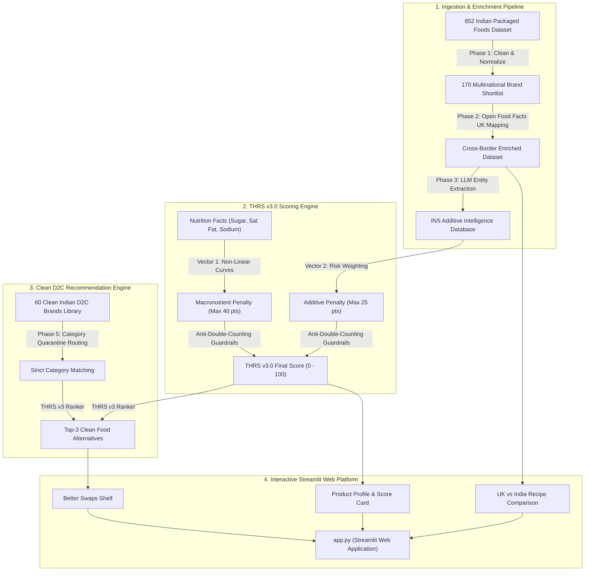

# 🌿 TRUE INGREDIENTS — Food Intelligence Platform

> **Empirical ingredient intelligence, cross-border recipe difference detection, and clean Indian startup (D2C) food alternatives before you buy.**

[](https://www.python.org/)
[](https://streamlit.io/)
[](LICENSE)
[]()

---

## 📸 Application Preview

| **Interactive Search & 1-Click Popular Shelf** |
| :---: |
|  |

| **Cross-Border Recipe Inspector** | **Clean D2C Alternative Swaps** |
| :---: | :---: |
|  |  |

---

## 📌 Executive Overview

Ultra-processed packaged foods in India often contain hidden chemical additives, synthetic petroleum dyes, chemical preservatives, and excessive saturated fats or sugar. Furthermore, multinational food corporations frequently sell **lower-grade formulations in India** compared to their UK/European counterparts (e.g. using palm oil instead of sunflower oil, or synthetic Tartrazine dye instead of natural fruit extracts).

**True Ingredients** is an end-to-end consumer food intelligence platform that:
1. **Decodes 170 Packaged Indian Foods** across 6 core grocery categories.
2. **Evaluates Transparent Health Risk Scores (THRS v3.0)** using a non-linear dual-vector mathematical formulation.
3. **Exposes Global Recipe Discrepancies** via Open Food Facts UK/Global counterpart mapping.
4. **Recommends 60 Verified Clean Indian D2C Swaps** (*Slurrp Farm, Mille, The Whole Truth, BeatO, Yoga Bar, TBH*) with strict 100% category quarantine.

---

## 🏛️ System Architecture



---

## 🔬 Mathematical Scoring Framework (THRS v3.0)

The **Transparent Health Risk Score (THRS v3.0)** is calculated on a non-linear $0.0 \rightarrow 100.0$ scale:

$$\text{THRS v3.0} = 100 - \min(\mathbf{V_1} + \mathbf{V_2}, 100)$$

### 1. Vector 1: Macronutrient Density ($\mathbf{V_1}$, Max 40 pts)
Evaluates nutritional density against WHO and ICMR daily intake limits:
* **Added Sugar:** Evaluated on non-linear scaled curves preventing step-function cliff-edges.
* **Saturated Fats:** Penalizes heavy palm oil and hydrogenated fat concentrations.
* **Sodium Density:** Penalizes excessive sodium per 100g.

### 2. Vector 2: Additive & Chemical Burden ($\mathbf{V_2}$, Max 25 pts)
Rigorously evaluates synthetic chemicals and formulation additives:
* **Formulation Signals (-10 pts each):** Synthetic azo dyes (*INS 102 Tartrazine, INS 110 Sunset Yellow, INS 129 Allura Red*), chemical preservatives (*INS 211 Sodium Benzoate, INS 224 Metabisulphite*), and high-potency artificial sweeteners (*INS 950, 951, 955*).
* **Watch Additives (-3 pts each):** Ultra-processed emulsifiers and thickeners (*INS 471 Mono- and diglycerides, INS 476 PGPR*).
* **Standard Additives (0 pts):** Natural bio-identical regulators (*Citric Acid, Rosemary Extract, Soy Lecithin*).

### 3. Anti-Double-Counting Guardrail
Prevents penalizing a single nutritional property twice (e.g. sugar in the nutrition panel and sugar in the ingredient text).

---

## 📁 Repository Structure

```text
ingredient_platform/
│
├── .gitignore                       # Clean Python, Jupyter & Streamlit exclusions
├── .streamlit/
│   └── config.toml                  # Locked light theme & port configuration
│
├── src/                             # Core Python Engine & Data Services
│   ├── __init__.py
│   ├── config.py                    # Path constants and configurations
│   ├── thrs_v3_scoring.py           # THRS v3.0 mathematical algorithms & scoring logic
│   └── ui_data_loader.py            # Unified in-memory loader (170 foods + 60 D2C swaps)
│
├── data/                            # Production Datasets (Cleaned & Enriched Data)
│   ├── health_scores_v3_staged.json # 170 audited Indian packaged foods with THRS v3 scores
│   ├── health_scores.json           # Phase 4 baseline health score reference
│   ├── clean_indian_startup_brands.json # 60 clean Indian D2C alternative products
│   ├── clean_indian_startup_brands_v3_scored.json # D2C audited health scores
│   ├── recommendations.json         # Guardrailed category recommendations
│   ├── llm_ingredient_intelligence.json # INS additive & formulation signals database
│   ├── multinational_brand_cleaned.csv  # Phase 1 cleaned dataset
│   ├── multinational_brand_enriched.csv # Phase 2 enriched cross-border dataset
│   ├── multinational_brand_shortlist.csv
│   └── packaged_foods_india-Ieivcg.csv  # 852 Indian supermarket items dataset
│
├── notebooks/                       # 📓 10 Core Phase Research & Analysis Notebooks
│   ├── Phase1_Data_Cleaning.ipynb
│   ├── Phase2_Data_Enrichment.ipynb
│   ├── Phase3_LLM_Verification_Intelligence.ipynb
│   ├── Phase4A_THRS_v3_Nutrition_Data_Audit.ipynb
│   ├── Phase4B_THRS_v3_Mathematical_Nutrition_Scoring_Design.ipynb
│   ├── Phase4C_THRS_v3_Ingredient_Signal_Audit_Design.ipynb
│   ├── Phase4D_THRS_v3_Model_Combination_Validation.ipynb
│   ├── Phase4G_THRS_v2_vs_Locked_v3_Final_Evaluation.ipynb
│   ├── Phase4H_THRS_v3_Final_Model_Integrity_Audit.ipynb
│   └── Phase5_kNN_Recommendation.ipynb
│
├── docs/                            # 📑 Technical Reviews & Architecture Documentation
│   ├── PROJECT_REVIEW_PHASE1_TO_4.md
│   ├── Phase1_Data_Cleaning_Review.md
│   └── screenshots/                 # Application screenshots
│
├── scripts/                         # Pipeline Generators & Verification Test Suites
│   ├── generate_170_recommendations_v3.py
│   ├── simulate_and_test_recommendations.py
│   └── test_ui_loader_v3_staging.py
│
├── app.py                           # 🚀 Main Interactive Streamlit Application
├── requirements.txt                 # Complete Python Dependencies
└── README.md                        # Production Documentation & Portfolio Guide
```

---

## 💻 Quickstart & Local Installation

### 1. Clone the Repository
```bash
git clone https://github.com/aryann13/Ingredient_Platform_Intelligence_platform.git
cd Ingredient_Platform_Intelligence_platform
```

### 2. Install Dependencies
```bash
pip install -r requirements.txt
```

### 3. Run the Web Application
```bash
streamlit run app.py
```
Open **`http://localhost:8501`** in your browser.

---

## 🧪 Automated Testing & Diagnostics

Run the automated regression test suite (validating all 7 safety criteria):
```bash
python scripts/test_ui_loader_v3_staging.py
```

Run the recommendation simulation test suite (verifying 0 category cross-contamination):
```bash
python scripts/simulate_and_test_recommendations.py
```

---

## 📄 License
This project is licensed under the MIT License - see the [LICENSE](LICENSE) file for details.
